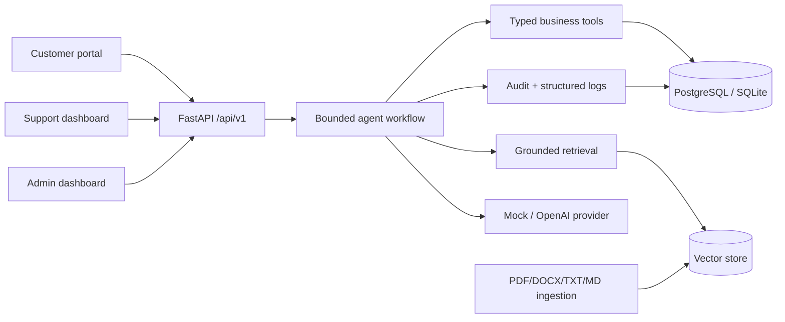
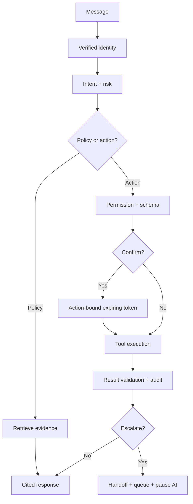

# Northstar Support AI

**Resolve faster. Escalate smarter. Support every customer.**

A portfolio-ready agentic customer-support platform for fictional electronics retailer Northstar Commerce. It combines cited RAG answers, authenticated customer/order tools, action-bound confirmations, deterministic risk escalation, human takeover, tool auditing, and three polished role experiences. All included identities and records are **synthetic demonstration data**.

## Why it is agentic

The bounded workflow validates identity, classifies intent and risk, chooses retrieval or one approved typed tool, enforces permission metadata, requests confirmation for sensitive writes, validates results, evaluates escalation, and persists a structured response. The model never gets raw database access and cannot change tool permissions.

## Architecture



## Agent flow



## Features

- Customer chat/history, policy citations, owned orders/shipping, tickets, cancellation confirmation, human request
- Support queue, handoff package, transcript, tool timeline, takeover/reply/release, AI pause
- Admin knowledge upload/re-index/delete, actual local metrics, errors, and tool configuration
- PDF/DOCX/TXT/Markdown ingestion with type/size/hash validation and duplicate prevention
- Customer isolation, RBAC, internal-note separation, injection refusal, correlation IDs, safe logging
- Offline mock mode, Docker Compose, Alembic, pytest, Ruff, mypy, ESLint, CI, and 34-case evaluation

## Tool catalogue

`get_authenticated_customer`, `list_customer_orders`, `get_order_details`, `get_shipping_status`, `check_cancellation_eligibility`, `cancel_order`, `check_return_eligibility`, `list_customer_tickets`, `get_ticket_details`, `create_support_ticket`, `update_ticket_priority`, `add_ticket_message`, and `escalate_to_human`. Cancellation requires explicit action-specific confirmation. Each tool declares roles, identity, mutation, confirmation, and frequency limits.

## Demo accounts

| Role | Email | Password |
|---|---|---|
| Customer | `customer01@northstar.demo` | `Demo123!` |
| Support | `agent1@northstar.demo` | `Agent123!` |
| Admin | `admin@northstar.demo` | `Admin123!` |

Seed data: 15 customers, 5 agents, 25 products, 45 orders, 135 items, 173 shipping events, 30 tickets, 90 ticket messages, and 8 policies.

## Run

```bash
cp .env.example .env
docker compose up --build
```

Open `http://localhost:3000`; OpenAPI is at `http://localhost:8000/docs`. All four containers include health checks and named volumes persist PostgreSQL, Redis, uploads, and vectors.

Local fallback:

```bash
python -m pip install -e "./backend[dev]"
cd backend && alembic upgrade head && python -m app.seed
uvicorn app.main:app --reload
# second terminal
cd frontend && npm ci && npm run dev
```

Quality commands: `make test`, `make lint`, `make evaluate`, and `cd frontend && npm run build`.

## Security and limitations

Business facts come only from customer-scoped tools; policy claims require retrieved evidence. Customer text, documents, tickets, and tool output are untrusted. Confirmation binds action plus canonical arguments and expires. Demo password hashing/stateless logout are not production authentication. JSON vectors and hash embeddings are local-demo infrastructure; production should use OIDC, Argon2id, pgvector/Qdrant, object storage, distributed rate limits, malware scanning, KMS secrets, and SIEM export. Shipping-address/refund/return writes are intentionally escalated rather than falsely presented as implemented.

See [Architecture](docs/ARCHITECTURE.md), [Agent design](docs/AGENT_DESIGN.md), [Tools](docs/TOOLS.md), [RAG](docs/RAG_DESIGN.md), [Security](docs/SECURITY.md), [Evaluation](docs/EVALUATION.md), [API](docs/API.md), [Deployment](docs/DEPLOYMENT.md), and [Portfolio content](docs/PORTFOLIO_CONTENT.md).

MIT licensed. Northstar Commerce is fictional.
