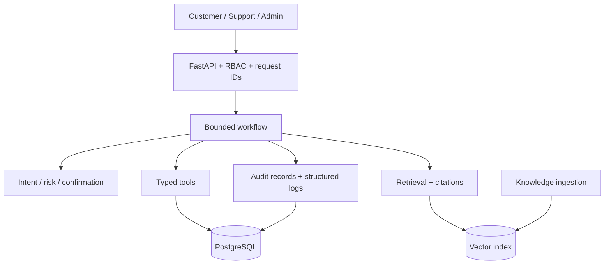

# Architecture
React role portals call versioned FastAPI routes. Authentication/RBAC resolves a verified user and customer profile. `SupportWorkflow` routes one bounded turn to RAG or the typed `ToolExecutor`; SQLAlchemy persists domain state, messages, tool executions, confirmations, and handoffs. PostgreSQL is primary; SQLite is the local fallback. The local JSON vector store is transparent single-node demo infrastructure.

Users/customer profiles anchor isolation; products/orders/items/shipping are verified business state; conversations/messages hold short-term context; tickets split public messages from internal notes; escalations hold structured handoffs. Trade-offs: deterministic rules are testable but less nuanced, JSON vectors are inspectable but not multi-node, and bounded autonomy is favored over an unrestricted loop.
